<div align="center">


# LeafScan

### Leaf disease diagnosis in seconds

Photograph one leaf. LeafScan names the most likely of **26 diseases across 14 crops**, says how
confident it is, and tells you what to do next.

[](https://github.com/eshdobhal/LEAFSCAN-PLANT-DISEASE-DETECTION/actions/workflows/tests.yml)


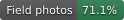

[](LICENSE)

**Author: Esh Dobhal**

### [▶ Try it live: eshdobhal.github.io/LEAFSCAN-PLANT-DISEASE-DETECTION/](https://eshdobhal.github.io/LEAFSCAN-PLANT-DISEASE-DETECTION/)

*Runs entirely in your browser: your photo never leaves your device.*

**New: LeafScan Surveillance (Project 05).** Diseased-leaf and pest **detection**, damaged-tissue
**segmentation** with a severity grade, a 7-day **progression forecast**, a batch and video **CLI**, and a
full evaluation package. See the [technical report](docs/TECHNICAL_REPORT.md),
[model card](docs/MODEL_CARD.md) and [2-minute demo video](docs/demo/leafscan_demo.mp4).

<picture>
  <source media="(prefers-color-scheme: dark)" srcset="screenshots/home-desktop-dark.png">
  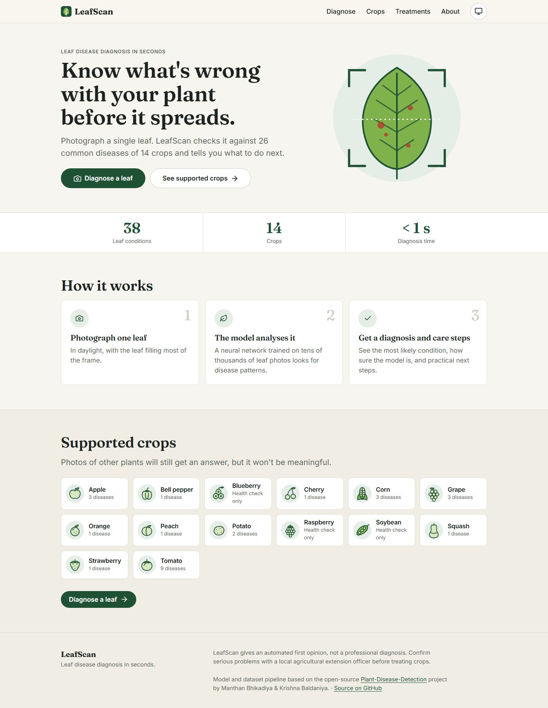
</picture>

</div>

---

## Contents

1. [Overview](#1-overview)
2. [Key results](#2-key-results)
3. [Features](#3-features)
4. [Outputs and screenshots](#4-outputs-and-screenshots)
5. [System architecture](#5-system-architecture)
6. [Object-oriented analysis and design (OOAD)](#6-object-oriented-analysis-and-design-ooad)
7. [Model architecture](#7-model-architecture)
8. [Data and training](#8-data-and-training)
9. [Performance](#9-performance)
10. [End-to-end workflow](#10-end-to-end-workflow)
11. [REST API](#11-rest-api)
12. [Getting started](#12-getting-started)
13. [Testing and quality](#13-testing-and-quality)
14. [Deployment](#14-deployment)
15. [Security and privacy](#15-security-and-privacy)
16. [Project structure](#16-project-structure)
17. [Limitations and future work](#17-limitations-and-future-work)
18. [Documentation](#18-documentation)
19. [Author](#19-author)
20. [License](#20-license)

---

## 1. Overview

**The problem.** Crop diseases cost growers a large share of their harvest every year, and the first
sign is usually a marked leaf. Expert diagnosis is slow or out of reach for many small farmers and home
gardeners. Most published leaf-disease models score 98–99% on clean lab photos but fall to 11–41% on real
photos taken outdoors, which is where they are actually needed.

**The solution.** LeafScan is a web app that diagnoses a leaf from a single photo, built around a model
trained and evaluated specifically for real-world photos:

- A **hybrid CNN-Transformer** (CAFormer-S18): convolution layers read local texture such as spots and
  rings; self-attention layers relate distant parts of the leaf.
- Fine-tuned on **lab photos (PlantVillage) and real field photos (PlantDoc)**, with heavy augmentation.
- An **ensemble of two models** (224 px and 288 px input) plus mirror-image test-time augmentation.
- **Honest evaluation** on a leak-free split, and a "the model isn't sure" warning below 80% confidence.

The app runs on an ordinary laptop CPU in **0.2–0.4 s per photo**, works on phones and without JavaScript,
and never stores uploaded photos.

## 2. Key results

All numbers are measured once on held-out photos the models never saw during training
(`training/evaluate.py`; details in [DECISIONS.md](DECISIONS.md#hybrid-model-caformer-s18)).

| Held-out test set | Photos | Accuracy | Macro recall | Macro precision | Macro F1 |
|---|---:|---:|---:|---:|---:|
| **PlantVillage lab photos** (leaf-grouped split, no leakage) | 10,937 | **99.63%** | **99.53%** | 99.45% | 99.49% |
| **PlantDoc real field photos** | 225 | **71.11%** | **70.36%** | 72.86% | 69.27% |

- When the model is **at least 80% sure** on a field photo, it is **right 83.7% of the time**. Below 80%
  the app tells the user it isn't sure and how to retake the photo.
- Published PlantDoc field accuracy for classification is roughly 68–70% at best, and PlantVillage-only
  models score 11–41% there ([research summary](#research-context)).
- CPU latency: **190–360 ms** median per photo for the full ensemble (2 networks × 2 views), 70–140 ms
  with `ENSEMBLE=0` (same laptop, different power states; see [9.4](#94-latency-cpu-scriptsbenchmarkpy)).

### Surveillance system (Project 05)

`surveillance/` adds four more models around the classifier, and a command-line tool that runs them on photos
or video (`python -m surveillance.cli analyze leaf.jpg`). All results below are from untouched test sets
([technical report](docs/TECHNICAL_REPORT.md), [model card](docs/MODEL_CARD.md)).

| Question | Model | Test result |
|---|---|---|
| Where are the diseased leaves? | RetinaNet + ResNet-50-FPN, PlantDoc (29 classes) | mAP@0.5 **0.489** (target 0.40) |
| Is there pest damage? (tea) | RetinaNet + ResNet-50-FPN, tea field photos | AP@0.5 **0.96** red spider mite, **0.98** tea mosquito bug |
| How much tissue is damaged? | DeepLabV3-ResNet-50 | lesion IoU 0.58; severity grade within ±1 for **87.5%** of photos |
| Will it pass the action threshold? | LSTM on simulated epidemics | 7-day error **64% below** "tomorrow = today"; alert F1 0.74 |

Benchmarked against ResNet-50 and GoogLeNet (classification), Faster R-CNN and YOLOv8s (detection),
FCN and Mask R-CNN (segmentation, instances) and a vanilla RNN (forecasting). A NumPy-only
[`fundamentals/`](fundamentals/) module builds tensors, an MLP with backpropagation, four optimisers and
five classic learning rules from scratch, with ablations. **Two acceptance tests fail and are reported as
such** (lesion IoU 0.58 < 0.60; lesion-count F1 0.29 < 0.50), and the pest model runs **only on tea**
because it raises false pest alarms on 89% of photos of other crops.

## 3. Features

| For users | For developers and operators |
|---|---|
| Choose, drag-and-drop or paste a photo, or use the **live camera** (back camera on phones) | **JSON API** (`POST /api/predict`) and health check (`GET /healthz`) |
| Photos resized to 1024 px **in the browser** before upload: fast on slow mobile data | Application factory, all settings in `config.py`, overridable by environment variables |
| **Top-3 possibilities** with probability bars, and a **low-confidence warning** | Strict **Content-Security-Policy** with per-request nonce, security headers |
| **What to do** steps (or growing tips for healthy plants) and a suggested product | In-memory upload validation (type, Pillow decode, 8 MB, 40 MP limit) |
| **Try a sample**: four one-click photos, none used in training | Per-client **rate limiting** (HTTP 429), proxy-aware |
| **Treatments** page with instant search, crop filter and type toggle | **68 automated tests**, 15 of them in a real Chromium browser; CI on every push |
| Light/dark theme, keyboard accessible, print stylesheet, **works without JavaScript** | Reproducible training, evaluation and figure scripts |
| Private: photos are **processed in memory and never stored** | No CDNs, no front-end frameworks: Flask + Jinja, one CSS file, small vanilla JS |

## 4. Outputs and screenshots

### Diagnosis results

| Disease detected (uploaded photo) | Healthy leaf (sample photo) |
|---|---|
| <picture><source media="(prefers-color-scheme: dark)" srcset="screenshots/result-desktop-dark.png">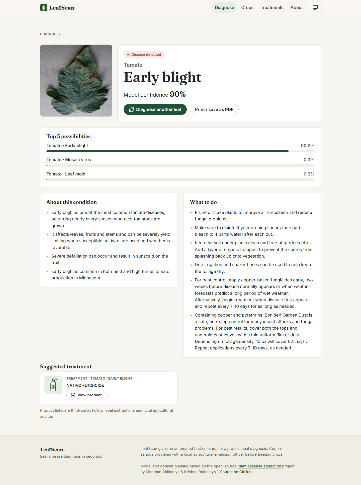</picture> | <picture><source media="(prefers-color-scheme: dark)" srcset="screenshots/result-sample-tomato-healthy-dark.png">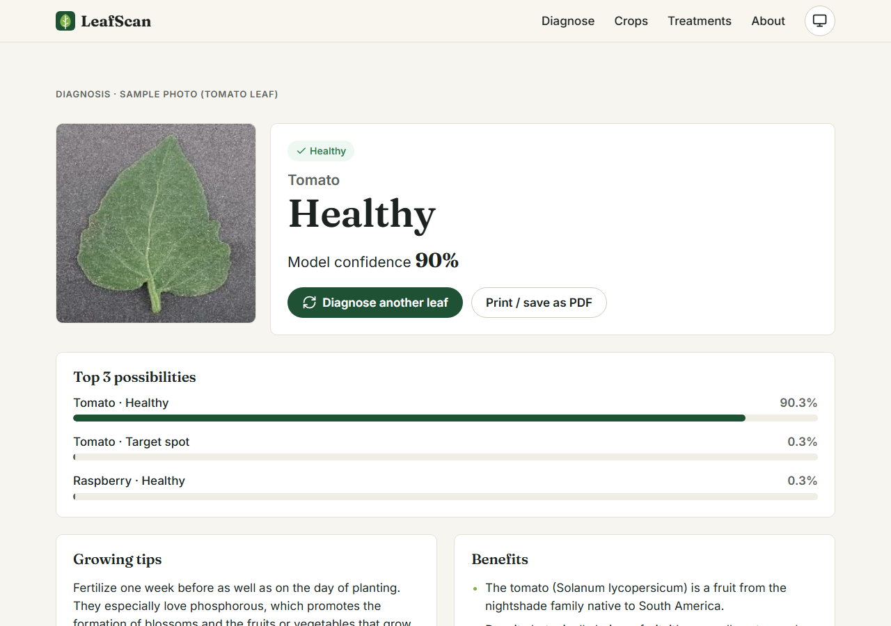</picture> |
| **Real-world web photo** (yellow leaf curl virus, 90% confident) | **Low confidence**: the app warns instead of over-claiming |
| <picture><source media="(prefers-color-scheme: dark)" srcset="screenshots/result-sample-tomato-leaf-curl-dark.png">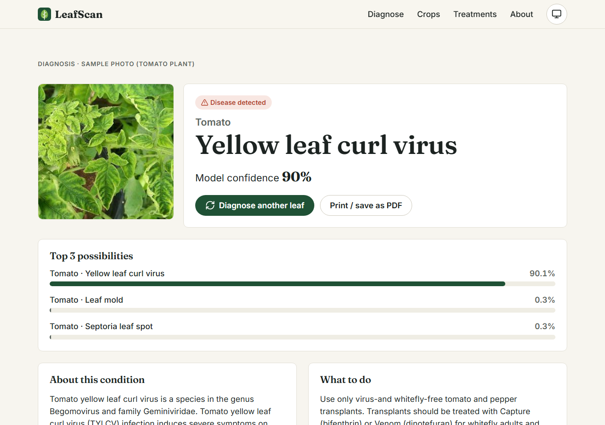</picture> | <picture><source media="(prefers-color-scheme: dark)" srcset="screenshots/result-low-confidence-dark.png">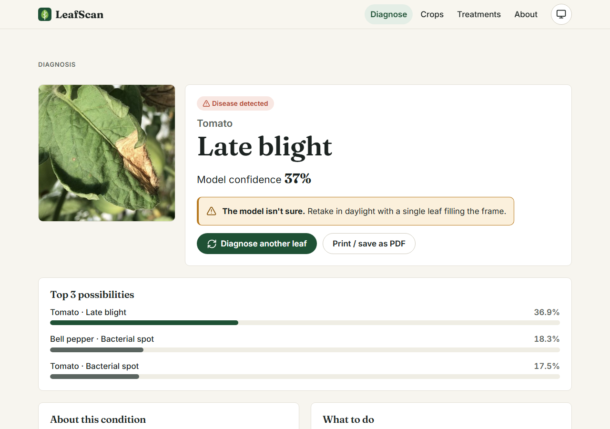</picture> |

### Live browser version (GitHub Pages)

| The page: the model loads once, then runs on the device | Result, computed in the browser |
|---|---|
| <picture><source media="(prefers-color-scheme: dark)" srcset="screenshots/web-home-desktop-dark.png">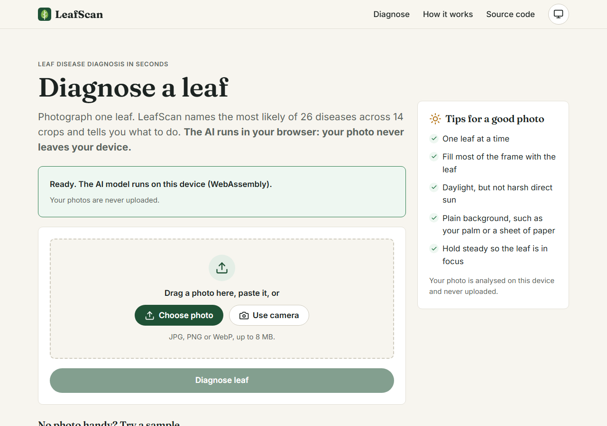</picture> | <picture><source media="(prefers-color-scheme: dark)" srcset="screenshots/web-result-desktop-dark.png">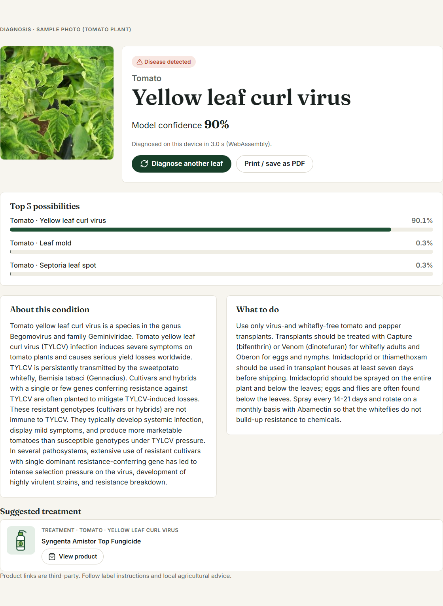</picture> |
| **Treatments**: every product, with search and filters | **Treatments on a phone** |
| <picture><source media="(prefers-color-scheme: dark)" srcset="screenshots/web-treatments-desktop-dark.png">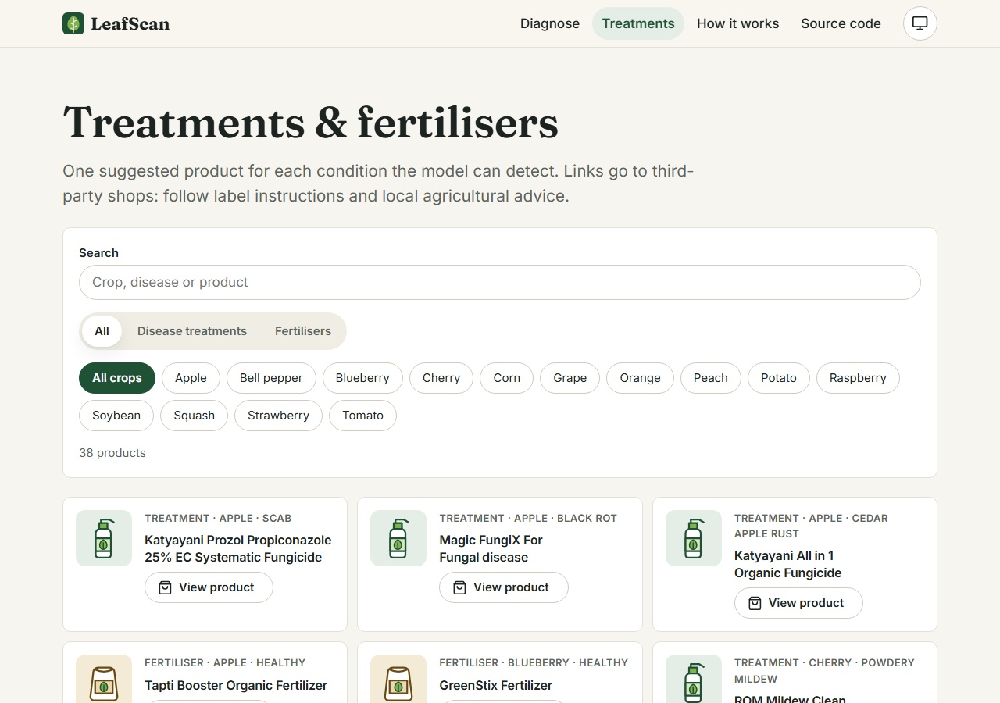</picture> | <picture><source media="(prefers-color-scheme: dark)" srcset="screenshots/web-treatments-mobile-dark.png">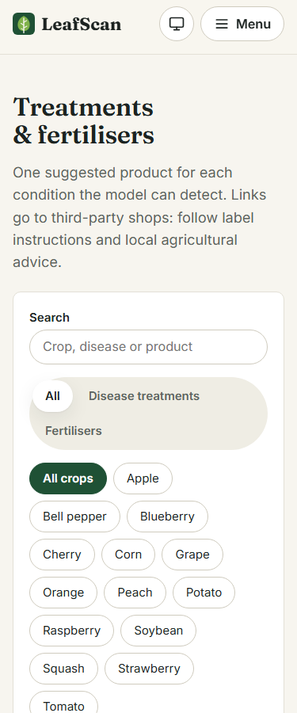</picture> |

### Diagnose, treatments and about

| Diagnose (upload, camera, samples) | Photo selected, ready to submit |
|---|---|
| <picture><source media="(prefers-color-scheme: dark)" srcset="screenshots/diagnose-desktop-dark.png">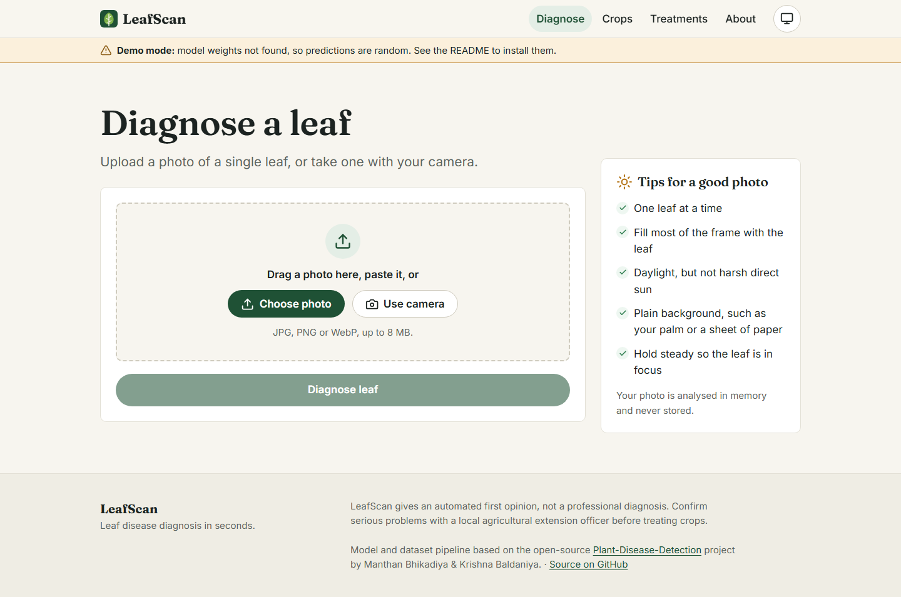</picture> | <picture><source media="(prefers-color-scheme: dark)" srcset="screenshots/diagnose-selected-desktop-dark.png">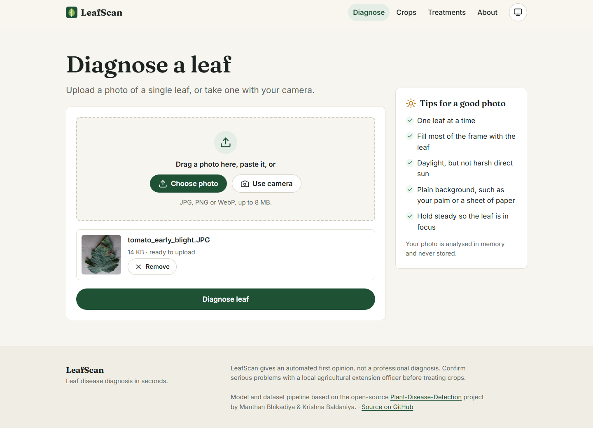</picture> |
| **Treatments** with search and filters | **About**: how the model works and how accurate it is |
| <picture><source media="(prefers-color-scheme: dark)" srcset="screenshots/treatments-desktop-dark.png">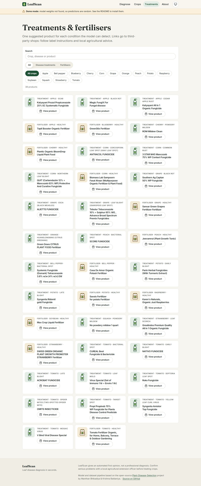</picture> | <picture><source media="(prefers-color-scheme: dark)" srcset="screenshots/about-desktop-dark.png">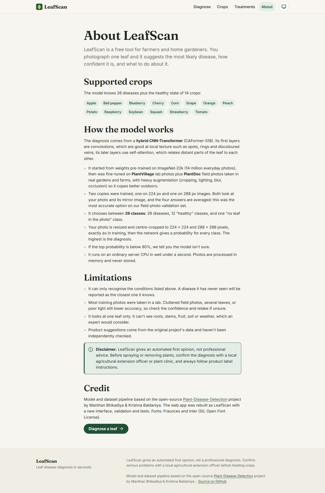</picture> |

### Live camera

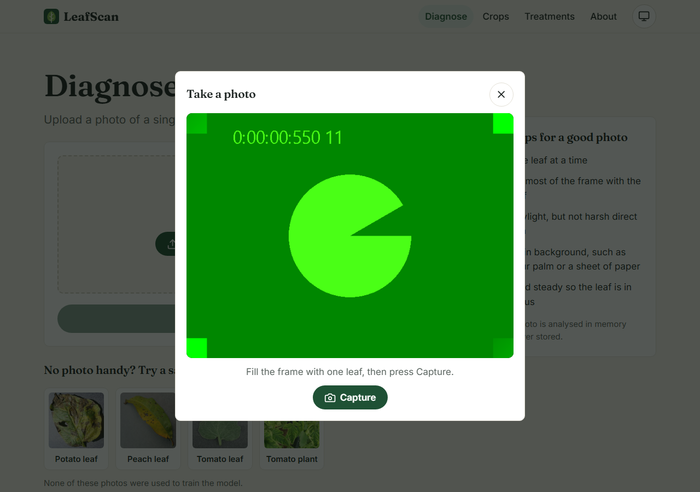

*The camera dialog, captured in an automated test with Chromium's simulated camera feed (the green test
pattern). On a phone it shows the back camera.*

### Mobile (375 px) and dark mode

<p>
  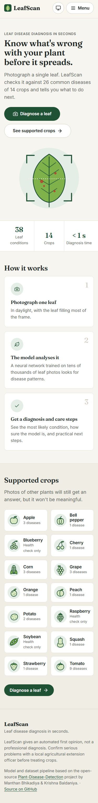
  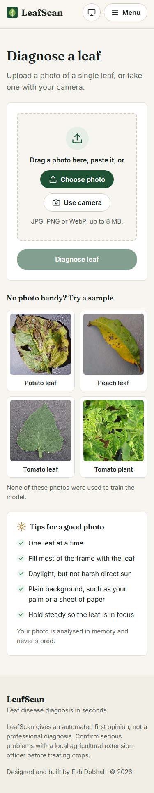
  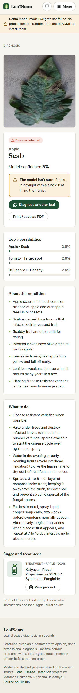
  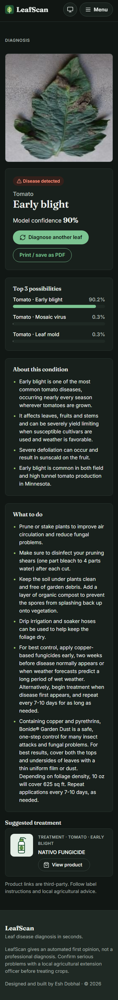
  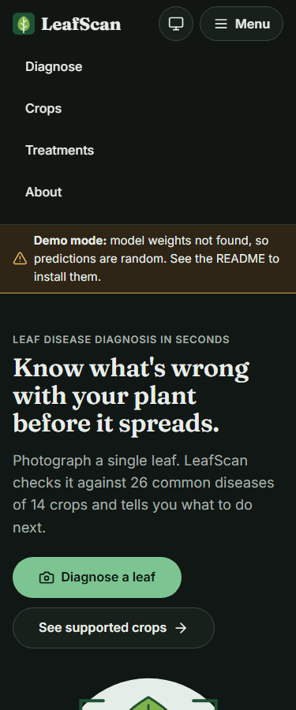
</p>

All 37 screenshots (every page at 375 px and 1440 px, light and dark) are in [`screenshots/`](screenshots)
and are regenerated by `scripts/screenshots.py`.

### API output

```console
$ curl -F "image=@test_images/potato_early_blight.JPG" http://127.0.0.1:5000/api/predict
{
  "label": "Potato___Early_blight",
  "crop": "Potato",
  "condition": "Early blight",
  "is_healthy": false,
  "is_background": false,
  "confidence": 0.9051,
  "low_confidence": false,
  "top3": [
    {"label": "Potato___Early_blight", "confidence": 0.9051},
    {"label": "Tomato___Late_blight", "confidence": 0.0029},
    {"label": "Pepper,_bell___Bacterial_spot", "confidence": 0.0027}
  ],
  "demo_mode": false,
  "notice": "An automated first opinion, not professional advice. Confirm with a local extension officer before treating."
}
```

## 5. System architecture

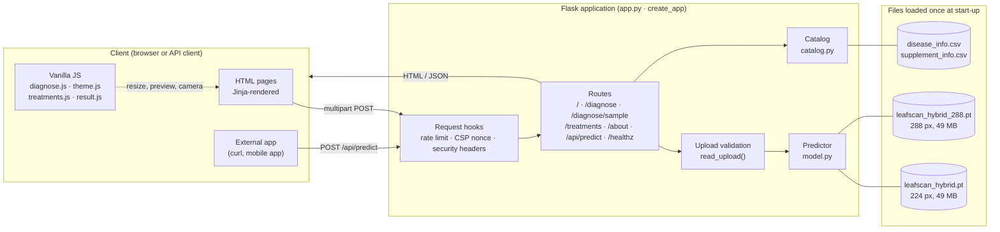
```mermaid
flowchart LR
    subgraph Client["Client (browser or API client)"]
        UI["HTML pages<br/>Jinja-rendered"]
        JS["Vanilla JS<br/>diagnose.js · theme.js<br/>treatments.js · result.js"]
        EXT["External app<br/>(curl, mobile app)"]
    end

    subgraph Server["Flask application (app.py · create_app)"]
        ROUTES["Routes<br/>/ · /diagnose · /diagnose/sample<br/>/treatments · /about · /api/predict · /healthz"]
        HOOKS["Request hooks<br/>rate limit · CSP nonce · security headers"]
        VALID["Upload validation<br/>read_upload()"]
        PRED["Predictor<br/>model.py"]
        CAT["Catalog<br/>catalog.py"]
    end

    subgraph Assets["Files loaded once at start-up"]
        W1[("leafscan_hybrid.pt<br/>224 px, 49 MB")]
        W2[("leafscan_hybrid_288.pt<br/>288 px, 49 MB")]
        CSV[("disease_info.csv<br/>supplement_info.csv")]
    end

    UI -- "multipart POST" --> HOOKS
    JS -. "resize, preview, camera" .-> UI
    EXT -- "POST /api/predict" --> HOOKS
    HOOKS --> ROUTES --> VALID --> PRED
    ROUTES --> CAT
    PRED --- W1 & W2
    CAT --- CSV
    ROUTES -- "HTML / JSON" --> Client
```

| Layer | Technology | Why |
|---|---|---|
| Web framework | Flask 3.1, Jinja2 | Small, explicit, easy to explain line by line |
| Model | PyTorch 2.9, torchvision, timm (CAFormer-S18) | Pre-trained hybrid backbones; CPU inference |
| Image handling | Pillow | Decode, verify, EXIF rotation, resize |
| Front end | HTML, one CSS file, vanilla JS | No build step, no framework, works without JS |
| Production server | gunicorn (Linux), waitress (Windows) | One process, four threads, model loaded once |
| Testing | pytest, Playwright (Chromium) | Unit, integration and real-browser tests |
| Training | PyTorch CUDA, scikit-learn metrics, matplotlib | Reproducible pipeline on a 6 GB laptop GPU |

## 6. Object-oriented analysis and design (OOAD)

### 6.1 Use case diagram

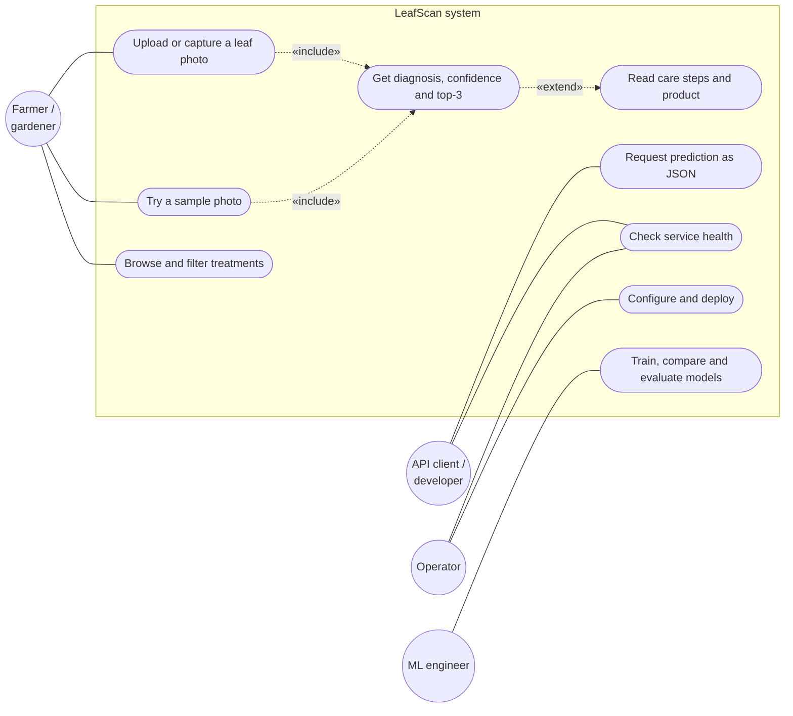
```mermaid
flowchart LR
    farmer(("Farmer /<br/>gardener"))
    dev(("API client /<br/>developer"))
    ops(("Operator"))
    mle(("ML engineer"))

    subgraph LeafScan["LeafScan system"]
        uc1(["Upload or capture a leaf photo"])
        uc2(["Get diagnosis, confidence and top-3"])
        uc3(["Read care steps and product"])
        uc4(["Try a sample photo"])
        uc5(["Browse and filter treatments"])
        uc6(["Request prediction as JSON"])
        uc7(["Check service health"])
        uc8(["Configure and deploy"])
        uc9(["Train, compare and evaluate models"])
    end

    farmer --- uc1 & uc4 & uc5
    uc1 -. "«include»" .-> uc2
    uc4 -. "«include»" .-> uc2
    uc2 -. "«extend»" .-> uc3
    dev --- uc6 & uc7
    ops --- uc7 & uc8
    mle --- uc9
```

| Actor | Goal |
|---|---|
| Farmer / gardener | Find out what is wrong with a plant and what to do, from a phone |
| API client | Integrate diagnosis into another app (`/api/predict`) |
| Operator | Deploy, configure (environment variables), monitor (`/healthz`, logs) |
| ML engineer | Rebuild the dataset, retrain, compare on validation, evaluate once on test |

### 6.2 Class diagram

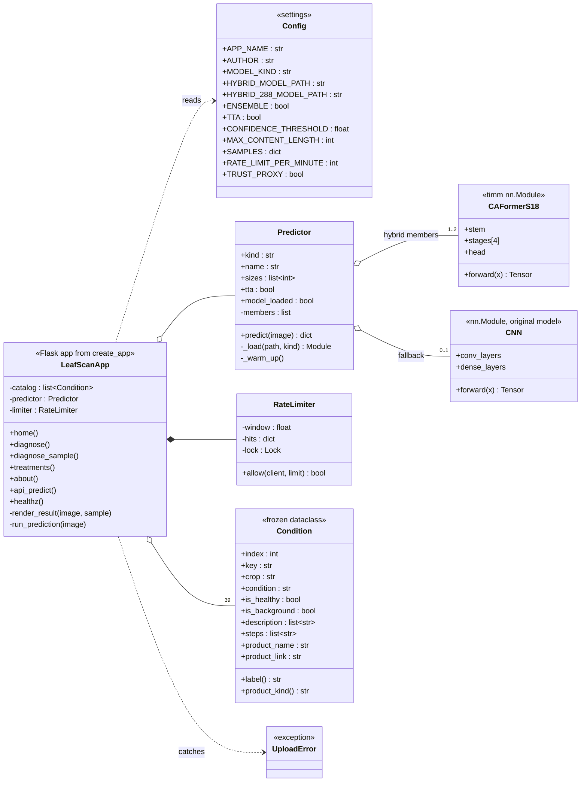
```mermaid
classDiagram
    direction LR

    class Config {
        <<settings>>
        +APP_NAME : str
        +AUTHOR : str
        +MODEL_KIND : str
        +HYBRID_MODEL_PATH : str
        +HYBRID_288_MODEL_PATH : str
        +ENSEMBLE : bool
        +TTA : bool
        +CONFIDENCE_THRESHOLD : float
        +MAX_CONTENT_LENGTH : int
        +SAMPLES : dict
        +RATE_LIMIT_PER_MINUTE : int
        +TRUST_PROXY : bool
    }

    class LeafScanApp {
        <<Flask app from create_app>>
        -catalog : list~Condition~
        -predictor : Predictor
        -limiter : RateLimiter
        +home()
        +diagnose()
        +diagnose_sample()
        +treatments()
        +about()
        +api_predict()
        +healthz()
        -render_result(image, sample)
        -run_prediction(image)
    }

    class Predictor {
        +kind : str
        +name : str
        +sizes : list~int~
        +tta : bool
        +model_loaded : bool
        -members : list
        +predict(image) dict
        -_load(path, kind) Module
        -_warm_up()
    }

    class RateLimiter {
        -window : float
        -hits : dict
        -lock : Lock
        +allow(client, limit) bool
    }

    class Condition {
        <<frozen dataclass>>
        +index : int
        +key : str
        +crop : str
        +condition : str
        +is_healthy : bool
        +is_background : bool
        +description : list~str~
        +steps : list~str~
        +product_name : str
        +product_link : str
        +label() str
        +product_kind() str
    }

    class UploadError {
        <<exception>>
    }

    class CAFormerS18 {
        <<timm nn.Module>>
        +stem
        +stages[4]
        +head
        +forward(x) Tensor
    }

    class CNN {
        <<nn.Module, original model>>
        +conv_layers
        +dense_layers
        +forward(x) Tensor
    }

    LeafScanApp ..> Config : reads
    LeafScanApp *-- RateLimiter
    LeafScanApp o-- Predictor
    LeafScanApp o-- "39" Condition
    LeafScanApp ..> UploadError : catches
    Predictor o-- "1..2" CAFormerS18 : hybrid members
    Predictor o-- "0..1" CNN : fallback
```

### 6.3 Sequence diagram: diagnosing an uploaded photo

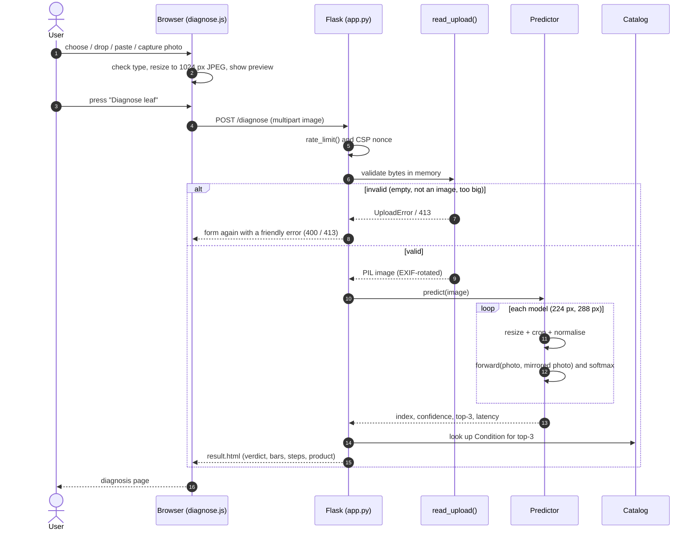
```mermaid
sequenceDiagram
    autonumber
    actor U as User
    participant B as Browser (diagnose.js)
    participant F as Flask (app.py)
    participant V as read_upload()
    participant P as Predictor
    participant C as Catalog

    U->>B: choose / drop / paste / capture photo
    B->>B: check type, resize to 1024 px JPEG, show preview
    U->>B: press "Diagnose leaf"
    B->>F: POST /diagnose (multipart image)
    F->>F: rate_limit() and CSP nonce
    F->>V: validate bytes in memory
    alt invalid (empty, not an image, too big)
        V-->>F: UploadError / 413
        F-->>B: form again with a friendly error (400 / 413)
    else valid
        V-->>F: PIL image (EXIF-rotated)
        F->>P: predict(image)
        loop each model (224 px, 288 px)
            P->>P: resize + crop + normalise
            P->>P: forward(photo, mirrored photo) and softmax
        end
        P-->>F: index, confidence, top-3, latency
        F->>C: look up Condition for top-3
        F-->>B: result.html (verdict, bars, steps, product)
    end
    B-->>U: diagnosis page
```

### 6.4 Sequence diagram: JSON API

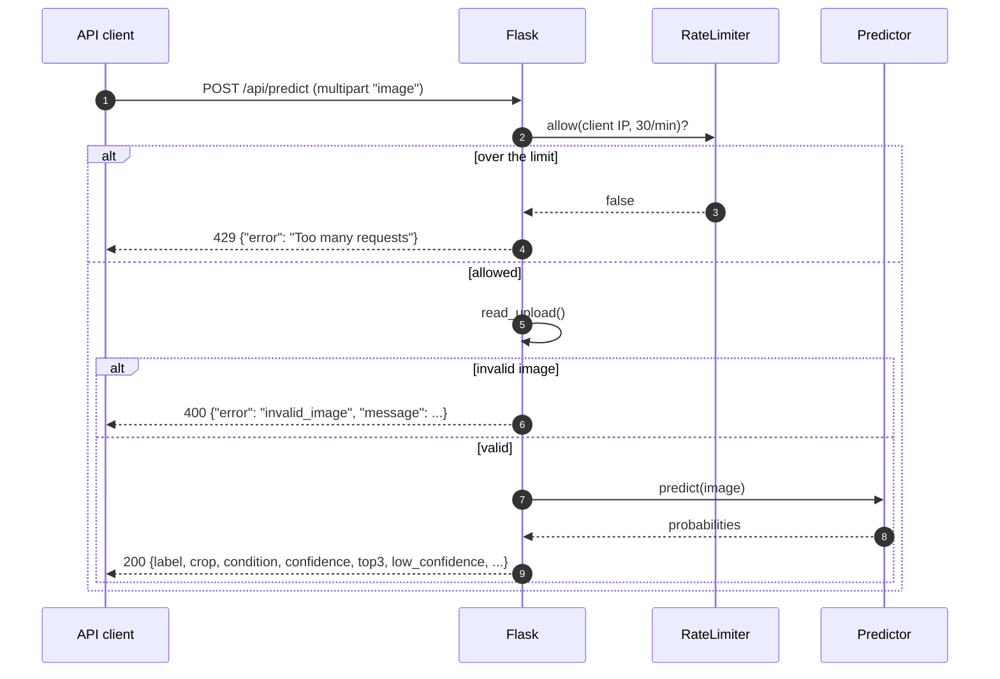
```mermaid
sequenceDiagram
    autonumber
    participant A as API client
    participant F as Flask
    participant R as RateLimiter
    participant P as Predictor

    A->>F: POST /api/predict (multipart "image")
    F->>R: allow(client IP, 30/min)?
    alt over the limit
        R-->>F: false
        F-->>A: 429 {"error": "Too many requests"}
    else allowed
        F->>F: read_upload()
        alt invalid image
            F-->>A: 400 {"error": "invalid_image", "message": ...}
        else valid
            F->>P: predict(image)
            P-->>F: probabilities
            F-->>A: 200 {label, crop, condition, confidence, top3, low_confidence, ...}
        end
    end
```

### 6.5 Activity diagram: from photo to advice

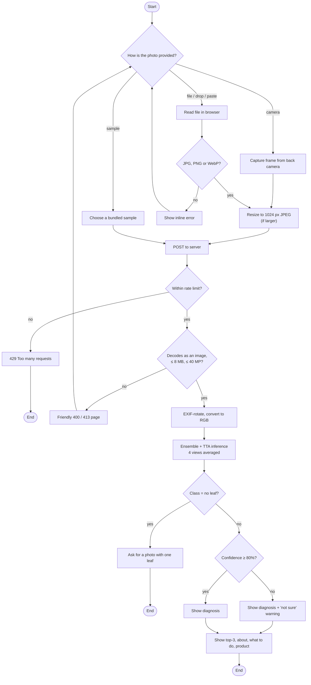
```mermaid
flowchart TD
    start([Start]) --> pick{"How is the photo provided?"}
    pick -->|"file / drop / paste"| file[Read file in browser]
    pick -->|camera| cam[Capture frame from back camera]
    pick -->|sample| samp[Choose a bundled sample]
    file --> type{"JPG, PNG or WebP?"}
    cam --> resize
    type -->|no| err1[Show inline error] --> pick
    type -->|yes| resize["Resize to 1024 px JPEG<br/>(if larger)"]
    resize --> post[POST to server]
    samp --> post
    post --> limit{"Within rate limit?"}
    limit -->|no| e429[429 Too many requests] --> stop1([End])
    limit -->|yes| valid{"Decodes as an image,<br/>≤ 8 MB, ≤ 40 MP?"}
    valid -->|no| e400[Friendly 400 / 413 page] --> pick
    valid -->|yes| prep[EXIF-rotate, convert to RGB]
    prep --> infer["Ensemble + TTA inference<br/>4 views averaged"]
    infer --> bg{"Class = no leaf?"}
    bg -->|yes| noleaf[Ask for a photo with one leaf] --> stop2([End])
    bg -->|no| conf{"Confidence ≥ 80%?"}
    conf -->|no| warn[Show diagnosis + 'not sure' warning]
    conf -->|yes| ok[Show diagnosis]
    warn --> advice
    ok --> advice[Show top-3, about, what to do, product]
    advice --> stop3([End])
```

### 6.6 State diagram: Diagnose page

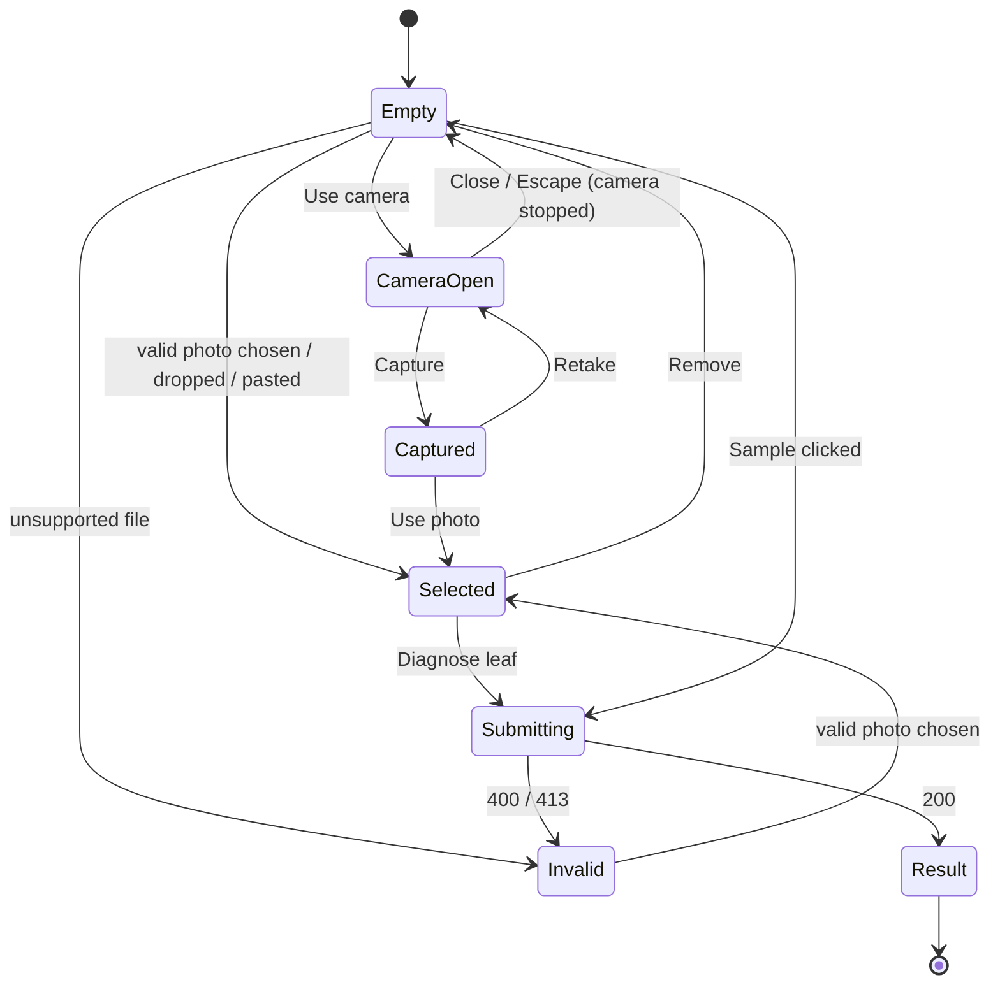
```mermaid
stateDiagram-v2
    [*] --> Empty
    Empty --> Selected : valid photo chosen / dropped / pasted
    Empty --> Invalid : unsupported file
    Invalid --> Selected : valid photo chosen
    Selected --> Empty : Remove
    Selected --> Submitting : Diagnose leaf
    Empty --> CameraOpen : Use camera
    CameraOpen --> Captured : Capture
    Captured --> CameraOpen : Retake
    Captured --> Selected : Use photo
    CameraOpen --> Empty : Close / Escape (camera stopped)
    Empty --> Submitting : Sample clicked
    Submitting --> Result : 200
    Submitting --> Invalid : 400 / 413
    Result --> [*]
```

### 6.7 Component diagram

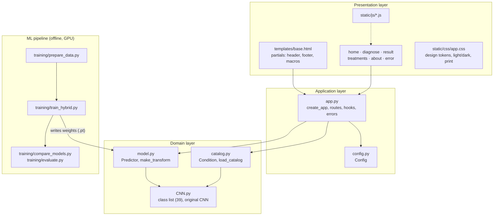
```mermaid
flowchart TB
    subgraph Presentation["Presentation layer"]
        T1["templates/base.html<br/>partials: header, footer, macros"]
        T2["home · diagnose · result<br/>treatments · about · error"]
        S1["static/css/app.css<br/>design tokens, light/dark, print"]
        S2["static/js/*.js"]
    end
    subgraph Application["Application layer"]
        A1["app.py<br/>create_app, routes, hooks, errors"]
        A2["config.py<br/>Config"]
    end
    subgraph Domain["Domain layer"]
        D1["model.py<br/>Predictor, make_transform"]
        D2["catalog.py<br/>Condition, load_catalog"]
        D3["CNN.py<br/>class list (39), original CNN"]
    end
    subgraph ML["ML pipeline (offline, GPU)"]
        M1["training/prepare_data.py"]
        M2["training/train_hybrid.py"]
        M3["training/compare_models.py<br/>training/evaluate.py"]
    end
    T1 & T2 --> A1
    S2 -.-> T2
    A1 --> A2 & D1 & D2
    D1 --> D3
    D2 --> D3
    M2 -- "writes weights (.pt)" --> D1
    M1 --> M2 --> M3
```

### 6.8 Deployment diagram

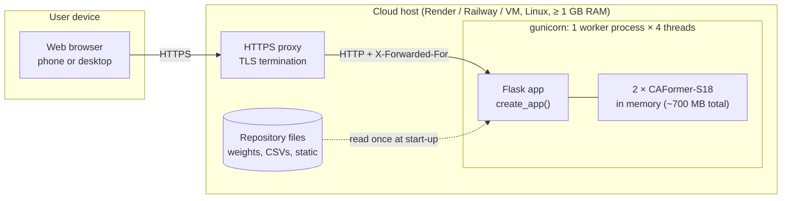
```mermaid
flowchart LR
    subgraph Device["User device"]
        BR["Web browser<br/>phone or desktop"]
    end
    subgraph Host["Cloud host (Render / Railway / VM, Linux, ≥ 1 GB RAM)"]
        PX["HTTPS proxy<br/>TLS termination"]
        subgraph Proc["gunicorn: 1 worker process × 4 threads"]
            APP["Flask app<br/>create_app()"]
            MOD["2 × CAFormer-S18<br/>in memory (~700 MB total)"]
        end
        FS[("Repository files<br/>weights, CSVs, static")]
    end
    BR -- "HTTPS" --> PX -- "HTTP + X-Forwarded-For" --> APP
    APP --- MOD
    FS -. "read once at start-up" .-> APP
```

One worker means the models are loaded once; four threads serve requests concurrently (PyTorch releases
Python's GIL during inference). The in-memory rate limiter is correct for exactly this single-process
design.

## 7. Model architecture

### 7.1 CAFormer-S18: a convolution + attention hybrid

CAFormer (Yu et al., *MetaFormer Baselines for Vision*, 2022) keeps one block design throughout and
changes only the **token mixer**: depthwise-separable convolutions in the early, high-resolution stages,
and self-attention in the later stages. Shapes below are for a 224 × 224 input (verified with timm).

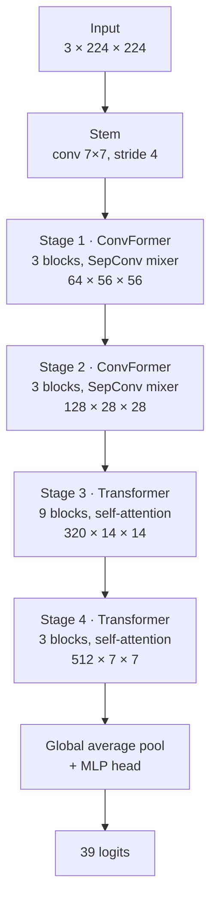
```mermaid
flowchart TB
    IN["Input<br/>3 × 224 × 224"] --> STEM["Stem<br/>conv 7×7, stride 4"]
    STEM --> S1["Stage 1 · ConvFormer<br/>3 blocks, SepConv mixer<br/>64 × 56 × 56"]
    S1 --> S2["Stage 2 · ConvFormer<br/>3 blocks, SepConv mixer<br/>128 × 28 × 28"]
    S2 --> S3["Stage 3 · Transformer<br/>9 blocks, self-attention<br/>320 × 14 × 14"]
    S3 --> S4["Stage 4 · Transformer<br/>3 blocks, self-attention<br/>512 × 7 × 7"]
    S4 --> HEAD["Global average pool<br/>+ MLP head"]
    HEAD --> OUT["39 logits"]
```

| Stage | Blocks | Token mixer | Channels | Resolution (224 input) | Good at |
|---|---:|---|---:|---:|---|
| 1 | 3 | Separable convolution | 64 | 56 × 56 | Fine texture: spots, rings, mould |
| 2 | 3 | Separable convolution | 128 | 28 × 28 | Lesion shapes, vein patterns |
| 3 | 9 | Multi-head self-attention | 320 | 14 × 14 | Relations across the whole leaf |
| 4 | 3 | Multi-head self-attention | 512 | 7 × 7 | Global context, background vs leaf |

**24.4 M parameters.** Pre-trained on ImageNet-22k (14 M images), fine-tuned here for 39 classes
(26 diseases, 12 healthy states, 1 "no leaf" background class).

### 7.2 Inference pipeline: ensemble + test-time augmentation

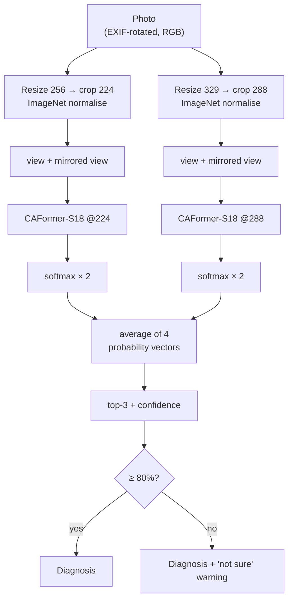
```mermaid
flowchart TB
    PHOTO["Photo<br/>(EXIF-rotated, RGB)"] --> A["Resize 256 → crop 224<br/>ImageNet normalise"]
    PHOTO --> B["Resize 329 → crop 288<br/>ImageNet normalise"]
    A --> A1["view + mirrored view"] --> MA["CAFormer-S18 @224"]
    B --> B1["view + mirrored view"] --> MB["CAFormer-S18 @288"]
    MA --> SA["softmax × 2"]
    MB --> SB["softmax × 2"]
    SA & SB --> AVG["average of 4<br/>probability vectors"]
    AVG --> TOP["top-3 + confidence"]
    TOP --> TH{"≥ 80%?"}
    TH -->|yes| R1["Diagnosis"]
    TH -->|no| R2["Diagnosis + 'not sure' warning"]
```

Why this design:

- **Hybrid, not pure CNN or pure ViT**: lesions are local textures, but deciding *which* disease often
  needs the whole leaf's pattern. Convolution stages give a strong texture bias with few images; attention
  stages add global context.
- **Two input sizes**: small lesions cover few pixels at 224 px. The 288 px model sees more detail; the two
  make different mistakes, so their average is more accurate than either (chosen on validation, confirmed
  on test).
- **Mirror TTA**: a leaf photographed the other way round is the same leaf; averaging both views smooths
  out orientation-specific errors at almost no cost in code.
- **Label smoothing (0.1)** during training keeps the reported confidence honest, which makes the 80%
  threshold meaningful.

The original project's CNN (4 convolution blocks + 2 dense layers) is still supported as a fallback
(`MODEL_KIND=cnn`) and keeps the same 39-class order.

## 8. Data and training

### 8.1 Datasets and leak-free splits (`training/prepare_data.py`)

| Split | Photos | Source | Used for |
|---|---:|---|---|
| train | 42,029 | PlantVillage official leaf-grouped train list (90%), background (70%), PlantDoc train (85%) | Training |
| val_lab | 4,473 | 10% of the PlantVillage train list + 10% of background | Choosing the epoch and the model |
| val_field | 351 | 15% of PlantDoc train | Choosing the epoch and the model |
| **test_lab** | **10,937** | PlantVillage official **leaf-grouped** test list + 20% of background | Final evaluation, once |
| **test_field** | **225** | PlantDoc test, minus 11 files byte-identical to training files | Final evaluation, once |

- **No leakage between photos of the same leaf.** PlantVillage has several photos of each physical leaf.
  A random split (as most projects use) puts the same leaf in train and test and inflates accuracy. The
  dataset maintainers' leaf-grouped split is used as-is.
- **Duplicates removed**: PlantDoc test photos that are byte-identical (MD5) to training photos are
  dropped.
- **Validation and test are separate**: every choice (epoch, input size, ensemble) was made on validation;
  the test sets were run once at the end.

### 8.2 Training recipe (`training/train_hybrid.py`)

| Setting | Value | Reason |
|---|---|---|
| Initial weights | `caformer_s18.sail_in22k_ft_in1k` | ImageNet-22k pre-training transfers well to small datasets |
| Optimiser | AdamW, weight decay 0.05 | Standard for transformer fine-tuning |
| Learning rate | 2e-4 (224 px), 1.5e-4 (288 px, smaller batch); 1 epoch warm-up, cosine decay | Stable start, smooth convergence |
| Epochs / batch | 8 / 32 (224 px), 8 / 20 (288 px) | Fits a 6 GB laptop GPU |
| Precision | bf16 autocast, channels-last | ~2× faster, half the memory |
| Loss | Cross-entropy, label smoothing 0.1 | Better-calibrated confidence |
| Augmentation | RandomResizedCrop (0.35–1), flips, TrivialAugmentWide, blur, random erasing | Make lab photos look like messy field photos |
| Sampling | 30% field / 70% lab draws; 1/√(class size) within each domain | Field photos seen often; rare classes boosted (recall) |
| Model selection | Best mean of lab and field validation **macro recall** | A missed disease is the costly error |
| Hardware / time | RTX 3050 Laptop (6 GB): 72 min (224 px), 117 min (288 px) | |

<picture>
  <source media="(prefers-color-scheme: dark)" srcset="docs/images/training-curves-dark.png">
  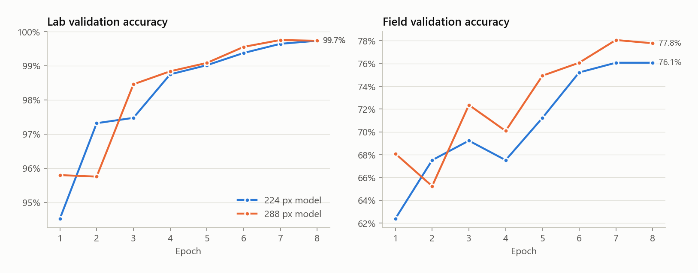
</picture>

## 9. Performance

### 9.1 Single models vs the shipped ensemble (real field photos)

<picture>
  <source media="(prefers-color-scheme: dark)" srcset="docs/images/model-comparison-dark.png">
  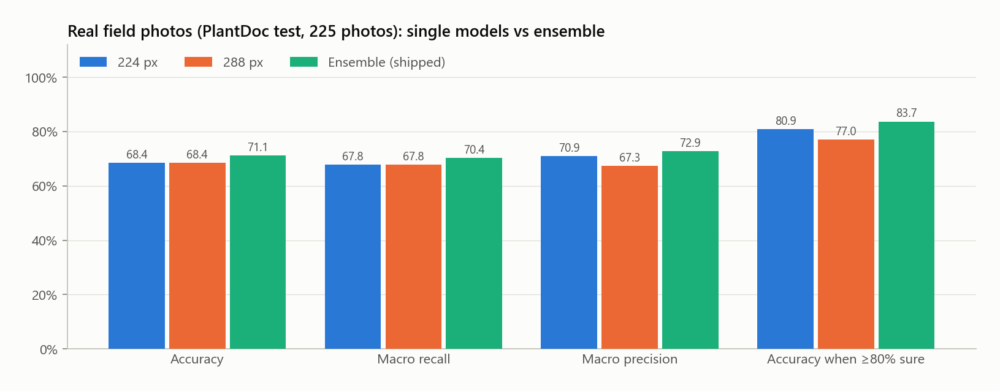
</picture>

| Model (with mirror TTA) | Lab accuracy | Lab macro recall | Field accuracy | Field macro recall | Field macro precision | Field accuracy when ≥ 80% sure | CPU latency |
|---|---:|---:|---:|---:|---:|---:|---:|
| CAFormer-S18 @224 | 99.45% | 99.34% | 68.44% | 67.76% | 70.89% | 80.89% | 70–147 ms |
| CAFormer-S18 @288 | 99.63% | 99.56% | 68.44% | 67.82% | 67.29% | 77.01% | 223 ms |
| **Ensemble (shipped)** | **99.63%** | **99.53%** | **71.11%** | **70.36%** | **72.86%** | **83.69%** | **190–360 ms** |

The ensemble was chosen on the **validation** sets (field validation accuracy 76.9% → 78.6%, macro recall
73.2% → 74.8%) before the test sets were run.

### 9.2 Recall per condition on real field photos

<picture>
  <source media="(prefers-color-scheme: dark)" srcset="docs/images/field-recall-per-class-dark.png">
  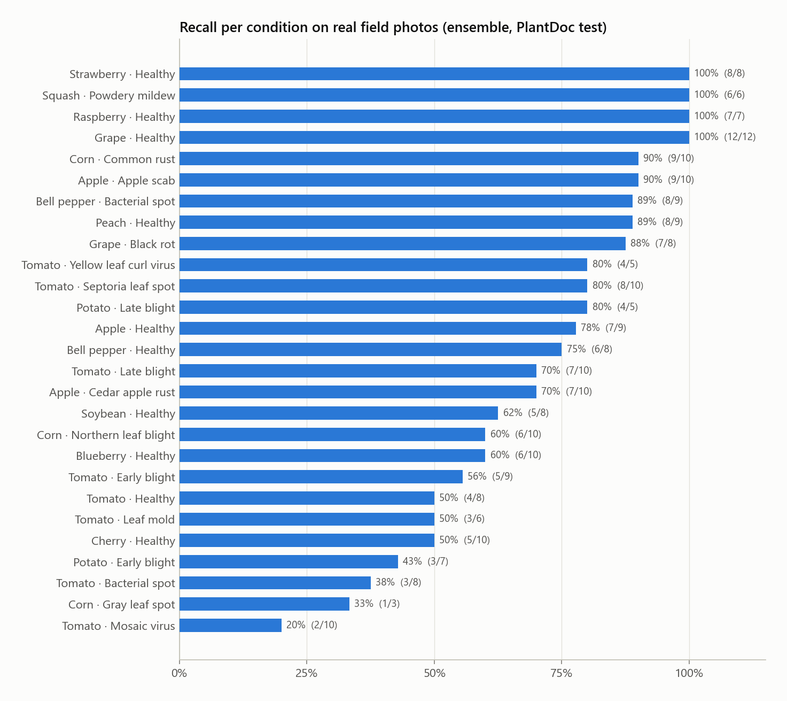
</picture>

### 9.3 Confusion matrix on real field photos

<picture>
  <source media="(prefers-color-scheme: dark)" srcset="docs/images/confusion-field-dark.png">
  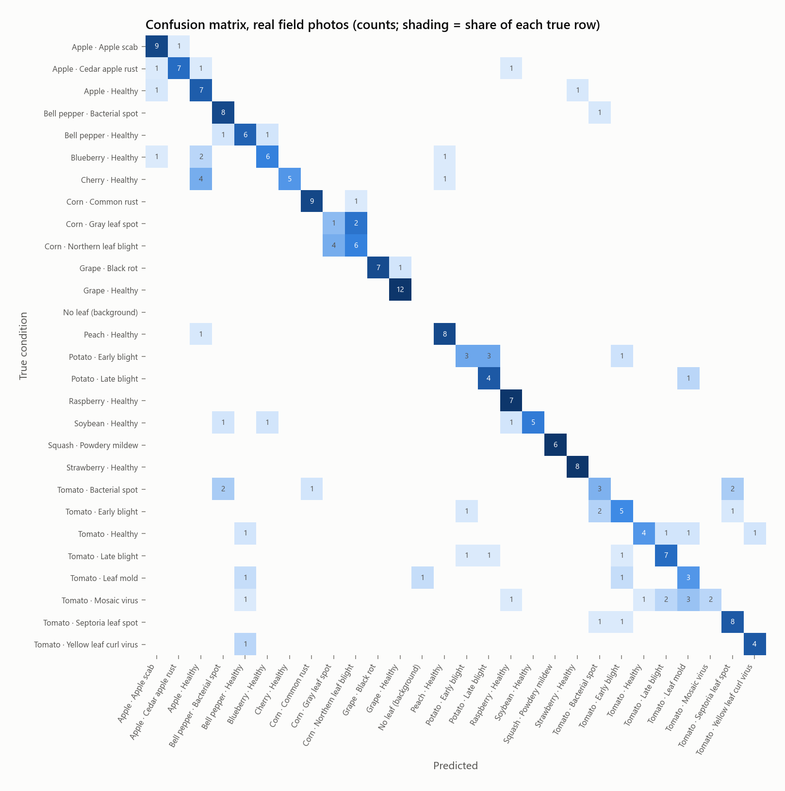
</picture>

Most remaining errors are between conditions that look alike in the field: corn northern leaf blight
vs gray leaf spot (4 photos), potato early vs late blight (3), tomato mosaic virus vs leaf mold and late
blight (5), tomato bacterial spot vs bell-pepper bacterial spot and septoria (4), and healthy cherry leaves
taken for healthy apple leaves (4). On lab photos the matrix is almost perfectly diagonal; the lowest lab
recall is corn gray leaf spot at 94.4%.

### 9.4 Latency (CPU, `scripts/benchmark.py`)

| Configuration | Median per photo | Notes |
|---|---:|---|
| Ensemble 224 + 288 px, mirror TTA (default) | **190–360 ms** | 2 networks × 2 views |
| Single 288 px model, mirror TTA | 223 ms | 2 views |
| Single 224 px model, mirror TTA (`ENSEMBLE=0`) | 70–147 ms | 2 views |
| Either, `TTA=0` | about half | 1 view per network |

Median of 20 runs on a gaming laptop CPU (16 logical cores) with PyTorch 2.9 limited to 4 threads. The
ranges are the same code measured on different days: the laptop's power profile changes CPU speed by about
2×. Every configuration stays well under one second. Server memory with both models loaded: about 700 MB.

### 9.5 How to read these numbers

- **Lab accuracy is saturated** across the literature; the meaningful number is **field accuracy**.
- The field test set has 225 photos (3–12 per class), so its 95% confidence interval is about ±6
  percentage points. Validation and test agree in direction, which is why the ensemble was kept.
- PlantDoc has no photos for 12 of the 39 classes (e.g. orange, grape esca, strawberry scorch), so those
  are learned from lab photos only and are less reliable in the field.

<a id="research-context"></a>
**Research context.** PlantVillage-only models fall to 11–41% on PlantDoc
([multi-crop benchmark](https://arxiv.org/pdf/2610.04456), [ConvGeM-next](https://pmc.ncbi.nlm.nih.gov/articles/PMC13201445/),
[domain-shift benchmark](https://github.com/Jenpoer/plant-disease-detection)); about 68% was the best
cross-domain classification figure found
([ViT + mixture of experts](https://www.researchgate.net/publication/393271735_Plant_disease_classification_in_the_wild_using_vision_transformers_and_mixture_of_experts)).
Field data, augmentation and pre-trained hybrids/ensembles help most
([Wiley 2026](https://onlinelibrary.wiley.com/doi/10.1111/jph.70264),
[ensembles + distillation](https://eprints.whiterose.ac.uk/id/eprint/233495/2/Deployable_Deep_Learning_for_Cross-Domain_Plant_Leaf_Disease_Detection_via_Ensemble_Learning_Knowledge_Distillation_and_Quantization.pdf),
[MobilePlantViT](https://arxiv.org/pdf/2503.16628)).

## 10. End-to-end workflow

### 10.1 Machine-learning lifecycle

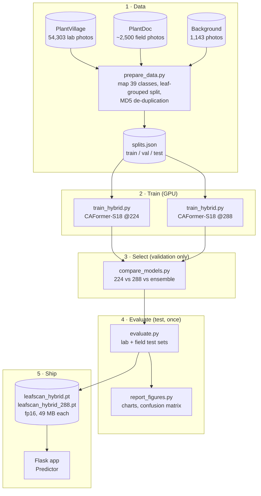
```mermaid
flowchart TB
    subgraph Data["1 · Data"]
        D1[("PlantVillage<br/>54,303 lab photos")]
        D2[("PlantDoc<br/>~2,500 field photos")]
        D3[("Background<br/>1,143 photos")]
        D1 & D2 & D3 --> PREP["prepare_data.py<br/>map 39 classes, leaf-grouped split,<br/>MD5 de-duplication"]
        PREP --> SPL[("splits.json<br/>train / val / test")]
    end
    subgraph Train["2 · Train (GPU)"]
        SPL --> T224["train_hybrid.py<br/>CAFormer-S18 @224"]
        SPL --> T288["train_hybrid.py<br/>CAFormer-S18 @288"]
    end
    subgraph Select["3 · Select (validation only)"]
        T224 & T288 --> CMP["compare_models.py<br/>224 vs 288 vs ensemble"]
    end
    subgraph Eval["4 · Evaluate (test, once)"]
        CMP --> EV["evaluate.py<br/>lab + field test sets"]
        EV --> FIG["report_figures.py<br/>charts, confusion matrix"]
    end
    subgraph Ship["5 · Ship"]
        EV --> PT[("leafscan_hybrid.pt<br/>leafscan_hybrid_288.pt<br/>fp16, 49 MB each")]
        PT --> APP["Flask app<br/>Predictor"]
    end
```

### 10.2 Request lifecycle (what happens in 0.2 seconds)

| Step | Where | What happens |
|---:|---|---|
| 1 | Browser | User picks, drops, pastes or captures a photo; `diagnose.js` checks the type |
| 2 | Browser | Large photos are resized to 1024 px JPEG on the device and previewed |
| 3 | Network | Multipart `POST /diagnose` (or `/api/predict`) |
| 4 | `app.py` | Rate limit check, CSP nonce created |
| 5 | `read_upload()` | Extension allow-list → Pillow `verify()` → format check → 8 MB / 40 MP limits → EXIF rotation, all in memory |
| 6 | `Predictor` | For each model: resize, crop, normalise; forward the photo and its mirror; softmax |
| 7 | `Predictor` | Average the 4 probability vectors; take top-3 and confidence |
| 8 | `catalog.py` | Look up names, description, steps and product for each class |
| 9 | `result.html` | Verdict, confidence, warning if < 80%, top-3 bars, advice, product |
| 10 | Response | Security headers added; nothing stored on the server |

## 11. REST API

| Method | Path | Description | Responses |
|---|---|---|---|
| `POST` | `/api/predict` | Diagnose a photo sent as multipart field `image` (JPG, PNG or WebP, ≤ 8 MB) | `200` JSON result · `400` invalid image · `413` too large · `429` rate limited |
| `GET` | `/healthz` | Liveness and model status | `200 {"status": "ok", "model_loaded": true, "model": "hybrid"}` |
| `GET` | `/` · `/diagnose` · `/treatments` · `/about` | HTML pages | `200` |
| `POST` | `/diagnose` | Diagnose from the HTML form | `200` result page · `400` / `413` / `429` friendly page |
| `POST` | `/diagnose/sample` | Diagnose a bundled sample (`sample=<name>`) | `200` · `404` unknown name |

**PowerShell example:**

```powershell
curl.exe -F "image=@test_images\potato_early_blight.JPG" http://127.0.0.1:5000/api/predict
```

**Error format** (always JSON under `/api/`):

```json
{"error": "invalid_image", "message": "We couldn't read that file as an image. Please try another photo."}
```

## 12. Getting started

### Requirements

- Python 3.11 or newer (tested with 3.13), Windows, macOS or Linux
- About 1 GB of free RAM; no GPU needed to run the app

### Install and run (Windows PowerShell)

```powershell
git clone https://github.com/eshdobhal/LEAFSCAN-PLANT-DISEASE-DETECTION.git
cd LEAFSCAN-PLANT-DISEASE-DETECTION
py -3.13 -m venv .venv
.\.venv\Scripts\Activate.ps1
pip install -r "Flask Deployed App\requirements.txt"
cd "Flask Deployed App"
flask --app app run
```

Open <http://127.0.0.1:5000>. The trained weights are included in the repository, so it works straight
away. On macOS/Linux use `python3 -m venv .venv` and `source .venv/bin/activate`.

### Configuration (environment variables)

| Variable | Default | Meaning |
|---|---|---|
| `MODEL_KIND` | `auto` | `hybrid`, `cnn`, or `auto` (hybrid if its weights exist, else CNN) |
| `HYBRID_MODEL_PATH` | `Flask Deployed App/leafscan_hybrid.pt` | 224 px hybrid weights |
| `HYBRID_288_MODEL_PATH` | `Flask Deployed App/leafscan_hybrid_288.pt` | 288 px hybrid weights |
| `ENSEMBLE` | on | `0` = use only the 224 px model (about 2.5× faster) |
| `TTA` | on | `0` = skip the mirror-image pass (about 2× faster) |
| `CONFIDENCE_THRESHOLD` | `0.80` | Below this, show the "not sure" warning |
| `REQUIRE_MODEL` | off | `1` = refuse to start without weights (production) |
| `RATE_LIMIT_PER_MINUTE` | `30` | Diagnoses per client IP per minute (`0` = no limit) |
| `TRUST_PROXY` | off | `1` behind a hosting proxy: real client IP and https |
| `FRAME_ANCESTORS` | `'none'` | Sites allowed to show the app in a frame (`https://huggingface.co` on Spaces) |
| `REPO_URL` | unset | Source-code link in the footer |
| `FLASK_DEBUG` | off | `1` = debugger and auto-reload (never in production) |
| `MODEL_PATH` | `Flask Deployed App/plant_disease_model_1_latest.pt` | Original CNN weights (optional fallback) |

App name, author, upload limit and sample photos live in `Flask Deployed App/config.py`.

## 13. Testing and quality

```powershell
pip install -r "Flask Deployed App\requirements-dev.txt"
python -m playwright install chromium
cd "Flask Deployed App"
python -m pytest                                   # 53 tests (browser tests skipped)
$env:E2E = "1"; python -m pytest; Remove-Item Env:E2E   # all 68, including 15 in Chromium
cd ..
python scripts\check_html.py      # tag balance, duplicate ids, alt text, no inline styles
python scripts\benchmark.py       # accuracy on test_images/ + median latency
python scripts\screenshots.py     # regenerates screenshots/ and checks for sideways scrolling
```

| Suite | Tests | Covers |
|---|---:|---|
| `tests/test_app.py` | 49 | Every page, redirects, 5 real uploads with expected diagnoses, PNG modes, empty/missing/fake/renamed files, path-traversal names, 9 MB upload (413), API schema and errors, security headers and configurable framing, no third-party assets, samples, author credit, rate limiting, responsible use (disclaimer on every result, "not sure" warning, no photo written to disk) |
| `tests/test_model.py` | 4 | Model selection (`auto`, ensemble on/off), top-3 output, preprocessing at 224 and 288 px |
| `tests/test_e2e.py` | 15 | Real Chromium: upload → result, sample button, 4000 px PNG resized in the browser, camera capture (dialog centred, stream stopped), filters, theme persistence, phone menu, no-JavaScript upload, no overflow at 320/375/1440 px, skip link, no console/CSP errors, API |
| `fundamentals/tests/` | 29 | Gradient checks of every NumPy layer against finite differences; neurons, optimisers, learning rules |
| `surveillance/tests/` | 16 | Detection labels and augmentation, lesion instances and F1, severity grades, temperature scaling and ECE, convolution by hand, simulation, forecaster, CLI |

GitHub Actions runs the 53 app and model tests with the real weights, and the 29 fundamentals tests, on every push
([`.github/workflows/tests.yml`](.github/workflows/tests.yml)). The browser version is built and tested in
Chromium before every deployment ([`.github/workflows/pages.yml`](.github/workflows/pages.yml));
`python web/test_web.py _site --parity` also compares it with PyTorch on every field test photo.

## 14. Deployment

### Live: browser version on GitHub Pages (free)

**https://eshdobhal.github.io/LEAFSCAN-PLANT-DISEASE-DETECTION/**

The live demo is a static page that runs both models **in the visitor's browser** with
[ONNX Runtime Web](https://onnxruntime.ai/docs/tutorials/web/): WebGPU where available (about 0.2 s per
photo on a laptop GPU), WebAssembly everywhere else (about 3 s). There is no server, so it is free, never
sleeps, scales to any number of visitors, and photos never leave the device.


```mermaid
flowchart LR
    PUSH["git push to main"] --> CI["GitHub Actions: pages.yml"]
    CI --> EXP["export_onnx.py<br/>.pt → ONNX (fp16 weights)"]
    EXP --> BUILD["build_site.py<br/>page + app CSS/JS + catalog.json"]
    BUILD --> TEST["test_web.py<br/>Chromium smoke test"]
    TEST --> PAGES[("GitHub Pages")]
    PAGES -- "HTML, JS, 2 × 47 MB models<br/>(downloaded once, cached)" --> BR["Visitor's browser"]
    BR --> ORT["ONNX Runtime Web<br/>WebGPU or WebAssembly"]
    ORT --> RES["Diagnosis on the device"]
```

| Check | Result |
|---|---|
| ONNX vs PyTorch, same input (225 field photos) | Same top-1 on 225/225; largest probability difference 0.000006 |
| Browser page vs server, end to end (225 field photos) | Same diagnosis on 219/225 (97.3%); the rest differ only through the browser's image resizing |
| Field accuracy, browser vs server | 72.0% vs 71.1% (the same within noise) |

The site has two pages: **Diagnose** (upload, paste, camera, samples, result) and **Treatments** (every
product, with the same search and filters as the Flask app). Trade-offs: the first visit to Diagnose downloads
about 93 MB (cached afterwards; the Treatments page needs no model), and there is no JSON API or server-side
rate limit (none is needed: each visitor uses their own device). Files: [`web/`](web) and
[`.github/workflows/pages.yml`](.github/workflows/pages.yml).

### Running the full Flask app on a server

Hugging Face Spaces: as of November 2026, Gradio and Docker Spaces need a PRO subscription (only static
Spaces are free). With PRO, the files in [`deploy/huggingface/`](deploy/huggingface) deploy the full app:
either the `Dockerfile`, or `app.py` + `requirements.txt` in a Gradio Space. Both download a tagged release
of this repository and serve the Flask app on port 7860 with `REQUIRE_MODEL=1`, `TRUST_PROXY=1` and
`FRAME_ANCESTORS=https://huggingface.co`.

**Render / Railway (Linux).** Root directory `Flask Deployed App`, build command
`pip install -r requirements.txt`, start command from the `Procfile`:

```
gunicorn "app:create_app()" --workers 1 --threads 4 --timeout 60
```

Set `REQUIRE_MODEL=1` and `TRUST_PROXY=1`. Choose an instance with at least 1 GB RAM (512 MB free tiers
are too small for both models; `ENSEMBLE=0` needs less). The live camera needs HTTPS, which these hosts
provide.

**Windows server.**

```powershell
cd "Flask Deployed App"
waitress-serve --listen=0.0.0.0:8000 --threads=4 --call app:create_app
```

## 15. Security and privacy

| Threat | Mitigation |
|---|---|
| Malicious upload (script renamed `.jpg`, decompression bomb) | Extension allow-list, Pillow `verify()`, format allow-list, 40 MP pixel cap, 8 MB body limit |
| Path traversal via file names | Uploads never touch the disk; sample names are checked against an allow-list |
| Cross-site scripting | Jinja auto-escaping; CSP `script-src 'self' 'nonce-…'`, no inline styles, no third-party scripts |
| Click-jacking, MIME sniffing, leaking URLs | CSP `frame-ancestors 'none'`, `X-Content-Type-Options: nosniff`, `Referrer-Policy`, `Permissions-Policy` (camera only on this site) |
| Pickle code execution in model files | `torch.load(..., weights_only=True)` |
| Flooding the CPU-heavy model | Per-IP sliding-window rate limit (429) |
| Privacy | Photos processed in memory, never stored; logs hold only the predicted label, confidence and latency (and a client IP only when it hits the rate limit) |

## 16. Project structure

```
LEAFSCAN-PLANT-DISEASE-DETECTION/
├── Flask Deployed App/             the web application
│   ├── app.py                      create_app(): routes, validation, rate limit, security headers, errors
│   ├── config.py                   every setting (environment-overridable)
│   ├── model.py                    Predictor: ensemble + TTA inference
│   ├── catalog.py                  Condition objects built from the CSVs
│   ├── CNN.py                      the 39-class list and the original CNN
│   ├── leafscan_hybrid.pt          224 px CAFormer-S18 weights (fp16, 49 MB)
│   ├── leafscan_hybrid_288.pt      288 px CAFormer-S18 weights (fp16, 49 MB)
│   ├── disease_info.csv, supplement_info.csv
│   ├── templates/                  base, partials, home, diagnose, result, treatments, about, error
│   ├── static/                     css/app.css, js/, icons.svg, img/ (incl. samples/), fonts/
│   ├── tests/                      test_app.py, test_model.py, test_e2e.py
│   ├── wsgi.py, Procfile           production entry points
│   └── requirements*.txt
├── fundamentals/                   NumPy-only tensors, MLP + backprop, optimisers, learning rules, ablations
├── surveillance/                   detection, segmentation, progression, generative, pipeline, CLI, evaluation
│   ├── results/                    figures, metrics and EVALUATION_SUMMARY.md
│   └── runs/                       per-model logs and test metrics (weights git-ignored)
├── demo/                           scripts and real CLI outputs behind the demo video
├── docs/                           requirements, dataset card, model card, technical report, user guide, demo video
├── training/                       data preparation, training, comparison, evaluation, figures
│   └── runs/                       training histories, test metrics, logs (weights git-ignored)
├── scripts/                        benchmark, screenshots, HTML checks, asset generation
├── docs/images/                    performance figures (light and dark)
├── web/                            browser version: page, ONNX export, site build and browser test
├── deploy/huggingface/             files for running the Flask app on Hugging Face Spaces
├── screenshots/                    37 app screenshots
├── test_images/                    43 sample leaf photos for the benchmark
├── Model/                          the original CNN training notebook
├── DECISIONS.md                    every design decision and its reason
├── CODE_WALKTHROUGH.md             file-by-file explanation with line numbers
├── requirements-research.txt       pinned research and training environment
└── THIRD_PARTY_NOTICES.md          datasets, libraries and assets used
```

## 17. Limitations and future work

**Limitations**

- About **71% accuracy on real field photos**: always check the confidence; under 80% the app says so.
- Only the 38 listed leaf conditions (plus "no leaf") are known; anything else is mapped to the closest.
- One leaf per photo; it cannot see roots, stems, fruit, soil or weather.
- Product suggestions and reference photos come from the CSV data files and have not been verified.
- An automated first opinion, not professional advice.

**Future work**

- More real field photos (the biggest lever; PlantDoc has only about 2,500).
- A third ensemble member of a different family (ConvNeXt or EfficientNet) for less correlated errors.
- Distil the ensemble into one network for single-model speed.
- Offline progressive web app with an on-device (ONNX / WebGPU) model.
- Multilingual interface for farmers.

## 18. Documentation

| Document | Contents |
|---|---|
| [docs/TECHNICAL_REPORT.md](docs/TECHNICAL_REPORT.md) | Project 05 report: methods, every result, error analysis, go/no-go against the 14 acceptance tests |
| [docs/MODEL_CARD.md](docs/MODEL_CARD.md) | Every model: intended use, measured out-of-scope behaviour, performance, training |
| [docs/DATASET_CARD.md](docs/DATASET_CARD.md) | Datasets, licences, de-duplication, leakage-safe splits, biases |
| [docs/REQUIREMENTS.md](docs/REQUIREMENTS.md) | Use case, stakeholders, acceptance tests, constraints, brief → evidence map |
| [docs/USER_GUIDE.md](docs/USER_GUIDE.md) | Using the browser version, the web app and the surveillance CLI |
| [docs/demo/leafscan_demo.mp4](docs/demo/leafscan_demo.mp4) | Two-minute demo video |
| [DECISIONS.md](DECISIONS.md) | Every design decision with its reason, full training tables and per-class results |
| [CODE_WALKTHROUGH.md](CODE_WALKTHROUGH.md) | File-by-file explanation and quick answers with exact line numbers |
| [THIRD_PARTY_NOTICES.md](THIRD_PARTY_NOTICES.md) | Datasets, model weights, libraries and assets used, with their licences |

## 19. Author

**Esh Dobhal** designed and built LeafScan: the web application, the hybrid-model training and
evaluation pipeline, the tests and the documentation.

- GitHub: [@eshdobhal](https://github.com/eshdobhal)

LeafScan uses public datasets and open-source libraries under their own licences; see
[THIRD_PARTY_NOTICES.md](THIRD_PARTY_NOTICES.md).

## 20. License

LeafScan is released under the [MIT License](LICENSE), © 2026 Esh Dobhal. You may use, copy, modify and
distribute it, including commercially, as long as the copyright notice and licence text are kept.

The MIT License covers the work in this repository authored by Esh Dobhal, including the trained
`leafscan_hybrid*.pt` weights. It does not relicense third-party material, which keeps its own terms:
`Flask Deployed App/CNN.py`, `disease_info.csv`, `supplement_info.csv`, `Model/`, `test_images/` and the sample photos
in `static/img/samples/` (copied from `test_images/`) come from an earlier project that publishes no licence, and the datasets, fonts and icons have their own licences.
Details are in [THIRD_PARTY_NOTICES.md](THIRD_PARTY_NOTICES.md).
